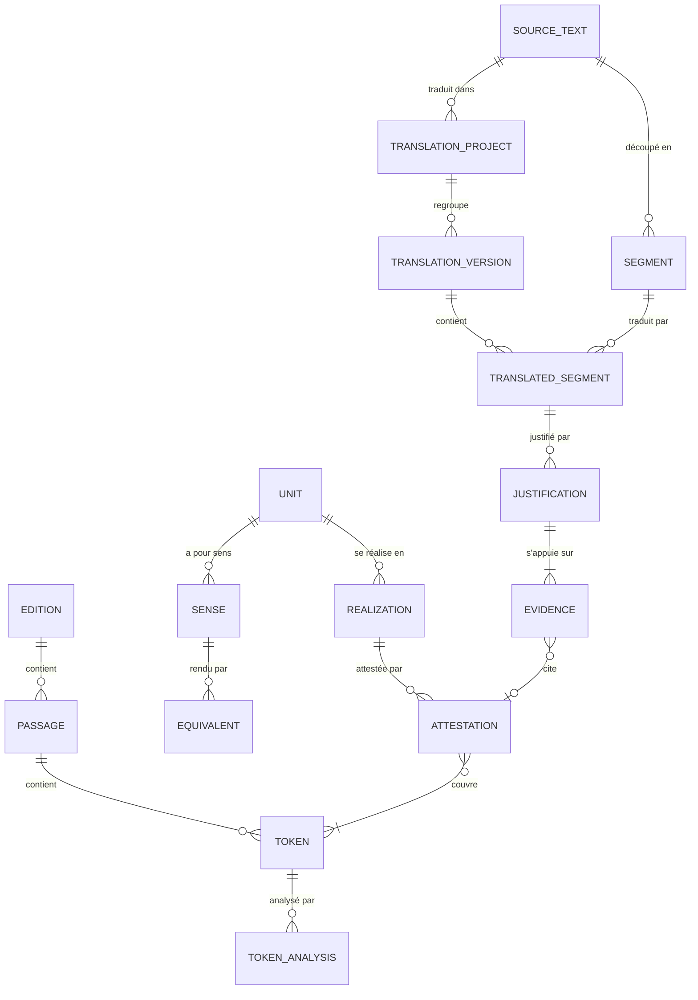

# Modèle de données

Esquisse conceptuelle, à préciser au moment de coder chaque étape. Les noms de code, en anglais, figurent entre parenthèses ; le glossaire complet est dans [`CLAUDE.md`](../CLAUDE.md). Les fonctions correspondantes sont décrites dans le [cahier des charges](cahier-des-charges.md).

## Vue d'ensemble

## 1. Corpus

- **Auteur** (`Author`) : nom usuel, nom latin, identifiant PHI ou Perseus (`phi0474` pour Cicéron), dates, époque.
- **Œuvre** (`Work`) : auteur, titre, abréviation usuelle (Cic. *Off.*), identifiant CTS, genre, registre, prose ou vers, date, appartenance au noyau.
- **Édition** (`Edition`) : œuvre, source (Perseus…), fichier, licence, version de la source (commit Git), date d'import. Une édition importée est figée : la réimporter crée une nouvelle édition.
- **Passage** (`Passage`) : édition, référence (1.23.4), URN CTS, ordre, texte brut.
- **Mot** (`Token`) : passage, position, forme imprimée, forme normalisée (u/v, i/j, ae, sans macrons, minuscules), ponctuation et espace qui suivent. L'identifiant d'un mot ne change jamais pour une édition donnée.
- **Couche d'analyse** (`AnalysisLayer`) : outil et version (LatinCy, treebank importé…), date. Relancer un outil crée une nouvelle couche.
- **Analyse d'un mot** (`TokenAnalysis`) : mot, couche, lemme, catégorie (UPOS), traits morphologiques, tête syntaxique, relation UD, origine (import vérifié, automatique, correction humaine).
- **Traduction en regard** (`ReferenceTranslation`) : œuvre, langue, traducteur, source, licence (domaine public), alignement par passage.

## 2. Phraséologie

- **Unité phraséologique** (`Unit`) : forme de référence, type (typologie fermée), étiquettes libres, schéma (lemmes et relations syntaxiques, par exemple `gero —obj→ bellum`), construction, registre, marques d'usage (poétique seulement, tardif, à éviter), renvois bibliographiques, statut, auteurs.
- **Réalisation** (`Realization`) : unité, forme type (*bellum geritur*), nature de la variation (passif, ordre des mots, insertion…).
- **Sens** (`Sense`) : unité, définition, registre, notes d'usage.
- **Équivalent** (`Equivalent`) : sens, langue, expression (« prendre une décision »).
- **Relation** (`UnitRelation`) : unité de départ, unité d'arrivée, type (synonyme, variante, antonyme, plus général, plus précis).
- **Attestation** (`Attestation`) : réalisation, sens, mots couverts (liste ordonnée, éventuellement discontinue), niveau (validée, automatique), origine (saisie manuelle, candidat, requête), statut, validée par, date.
- **Candidat** (`Candidate`) : lemmes et relation syntaxique, fréquence, score d'association, statut, unité créée le cas échéant.
- **Recherche infructueuse** (`NegativeSearch`) : expression, requête, version du corpus, date, auteur. Elle fonde la mention « introuvable dans le corpus (version X) ».
- **Néologisme** (`Neologism`) : forme latine, sens moderne, équivalents, formation (périphrase, dérivation, emprunt), justification, référence éventuelle au *Lexicon recentis Latinitatis* (citée, jamais recopiée).

## 3. Traduction

- **Texte source** (`SourceText`) : titre, auteur, langue, adresse d'origine, licence déclarée, statut juridique (domaine public, licence libre), ajouté par.
- **Segment** (`Segment`) : texte source, ordre, phrase.
- **Projet de traduction** (`TranslationProject`) : texte source, créateur, description, version de référence.
- **Version** (`TranslationVersion`) : projet, auteur, style déclaré (liste fermée : classique sans modèle particulier, cicéronien, césarien, sallustien, livien, sénéquien, tacitéen, plinien, latin tardif et chrétien, humaniste, latin vivant contemporain) et précision libre, état (brouillon, publiée), date de publication. Une version publiée reste modifiable par son auteur mais ne redevient jamais brouillon, même par un retour arrière.
- **Segment traduit** (`TranslatedSegment`) : version, segment, texte latin, révisions. Seul l'auteur de la version l'écrit ; son enregistrement ne compte pas dans la limite des nouveaux comptes.
- **Alignement fin** (`PhraseAlignment`, facultatif) : segment traduit, empan du texte source, empan du latin.

## 4. Justification

- **Justification** (`Justification`) : segment traduit, passage latin justifié (les mots tels qu'ils étaient écrits, avec leur position), empan du texte source (facultatif), force de preuve (1 à 5), commentaire, version du corpus interrogé (force 5), auteur. Seul l'auteur de la version justifie ses choix. Ce qu'exige chaque force :
  - 1 à 3 : au moins une attestation du corpus ;
  - 4, par analogie : un commentaire et au moins une preuve ;
  - 5, introuvable : la version du corpus interrogé est enregistrée, et un commentaire ou une preuve explique le choix.

  « À revoir » n'est pas enregistré mais calculé : la justification est à revoir quand la phrase latine ne contient plus le passage justifié (un passage seulement déplacé reste valable). Cela vaut aussi après un retour arrière.
- **Preuve** (`Evidence`) : justification, type (attestation, règle de grammaire, article de dictionnaire), mots cités du corpus (identifiants stables) et leur passage, ou ouvrage de référence avec sa localisation (paragraphe, entrée), note, retirée ou non. Une preuve ne peut être retirée que si la justification garde ce qu'exige sa force. L'attestation (`Attestation`) de l'étape 3 s'y ajoutera.
- **Ouvrage de référence** (`BibliographicWork`) : titre, abréviation (K-St, E-T, A&G, Gaffiot, L&S, TLL…), type (grammaire, dictionnaire), statut de droits (libre, ou sous droits et donc cité seulement). Liste tenue par les administrateurs ; aucun extrait n'est jamais stocké.
- **Contestation** (`Challenge`) : phrase traduite d'une version publiée, justification contestée (facultatif), passage contesté, auteur, argument, contre-exemples (preuves), discussion, votes, statut, décision motivée. Tout le monde sauf l'auteur de la version peut contester ; tant que la contestation est ouverte, une justification est attendue de l'auteur de la version (Q46). Un relecteur la retient ou l'écarte en motivant sa décision, ou son auteur la retire ; les arguments restent affichés (Q53). Un retour arrière ne rouvre ni ne clôt une contestation.

## 5. Communauté

- **Utilisateur** (`User`) : nom affiché, adresse e-mail, ORCID facultatif, déclaration de majorité, langue d'interface, compte confirmé (après une première contribution validée).
- **Rôles** : contributeur, relecteur, administrateur (groupes Django).
- **Révision** (`Revision`) : objet, auteur, date, contenu avant et après. Sert l'historique et le retour arrière.
- **Discussion** (`Comment`) : messages rattachés à un contenu qui l'autorise (pour l'instant les contestations ouvertes). Le fil est la liste des messages du contenu, sans objet séparé. Un message est un contenu modéré : révisions, signalement, masquage.
- **Vote** (`Vote`) : objet, auteur, valeur (pour ou contre). Un avis indicatif, modifiable ou retiré, sans historique. Votent les comptes confirmés et les relecteurs, sauf l'auteur de l'objet et, pour une contestation, l'auteur de la version contestée.
- **Signalement** (`Report`) : objet, auteur, motif, statut.

## 6. Statuts

| Objet | Cycle de vie |
|---|---|
| Unité | brouillon → proposée → validée ; contestée à tout moment |
| Attestation | automatique ou proposée → validée, ou rejetée |
| Version de traduction | brouillon → publiée |
| Justification | normale ; contestée ; à revoir quand le latin visé a changé |
| Contestation | ouverte → retenue ou écartée par un relecteur, ou retirée par son auteur |
| Candidat | à examiner → retenu ou rejeté |
| Signalement | ouvert → traité ou rejeté |

## 7. Règles à respecter

1. Une annotation humaine pointe vers des identifiants de mots, jamais vers des positions recalculées à la volée.
2. Créer une unité exige une forme de référence, un sens et une attestation.
3. Une unité ne devient « validée » que si tous ses champs obligatoires sont remplis ; fréquence et répartition sont calculées.
4. Une attestation automatique n'est jamais présentée comme validée.
5. Une justification de force « analogie » exige un commentaire.
6. Si le latin visé par une justification change, elle passe « à revoir ».
7. Toute mention d'absence indique la version du corpus interrogée.
8. Un brouillon n'est visible que de son auteur : aucune page, API ou export ne le renvoie à quelqu'un d'autre.
9. Un texte source sans licence compatible ne peut pas être ajouté.
10. Toute modification de contenu crée une révision.
11. Supprimer un compte anonymise ses contributions sans les supprimer.
12. Les ressources sous droits ne sont jamais stockées, seulement citées.
