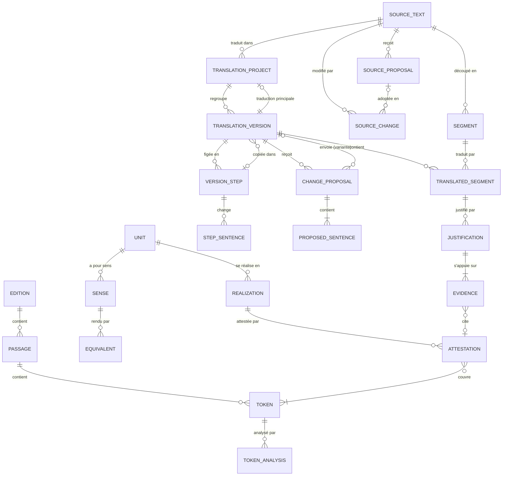

# Modèle de données

Esquisse conceptuelle, à préciser au moment de coder chaque étape. Les noms de code, en anglais, figurent entre parenthèses ; le glossaire complet est dans [`CLAUDE.md`](../CLAUDE.md). Les fonctions correspondantes sont décrites dans le [cahier des charges](cahier-des-charges.md).

## Vue d'ensemble

## 1. Corpus

- **Auteur** (`Author`) : nom usuel, nom latin, identifiant PHI ou Perseus (`phi0474` pour Cicéron), dates, époque.
- **Œuvre** (`Work`) : auteur, titre, abréviation usuelle (Cic. *Off.*), identifiant CTS, genre, registre, prose ou vers, date, appartenance au noyau.
- **Édition** (`Edition`) : œuvre, source (Perseus…), fichier, licence, version de la source (commit Git), date d'import. Une édition importée est figée : la réimporter crée une nouvelle édition.
- **Passage** (`Passage`) : édition, référence (1.23.4), URN CTS, ordre, texte brut.
- **Mot** (`Token`) : passage, position, forme imprimée, forme normalisée (u/v, i/j, ae, sans macrons, minuscules), ponctuation et espace qui suivent. L'identifiant d'un mot ne change jamais pour une édition donnée.
- **Couche d'analyse** (`AnalysisLayer`) : outil et version (LatinCy, treebank importé…), date. Relancer un outil crée une nouvelle couche.
- **Analyse d'un mot** (`TokenAnalysis`) : mot, couche, lemme, catégorie (UPOS), traits morphologiques, tête syntaxique, relation UD, origine (import vérifié, automatique, correction humaine).
- **Traduction en regard** (`ReferenceTranslation`) : œuvre, langue, traducteur, année de sa mort, parution, source, fichier, version de la source, licence de la numérisation. Importée depuis le catalogue `corpus/data/translations.csv`, seulement si elle est du domaine public (traducteur mort depuis plus de 70 ans, ou parution depuis au moins 170 ans si la date de mort est inconnue). Ses parties (`TranslationPart` : ordre, référence, texte) s'alignent sur le latin par référence : la page d'un passage montre la partie de même référence, ou celle, plus large, qui la contient.

## 2. Phraséologie

- **Unité phraséologique** (`Unit`) : forme de référence, forme de référence balisée (les fiches qu'elle contient, marquées entre crochets par leur nom puis leurs mots dans la forme : `[rēs pūblica;rem pūblicam] administrāre`, la forme de référence restant *rem pūblicam administrāre*), type (typologie fermée, provisoire en attendant le guide d'annotation), étiquettes libres, schéma, construction, registre, marques d'usage (poétique seulement, tardif, à éviter), statut, créée par, validée par. Les auteurs se lisent dans l'historique. Le schéma s'écrit une relation à la fois, le mot qui régit d'abord : `capio -obj-> consilium` ; plusieurs relations, séparées par « ; », forment un arbre (`gero -obj-> res; res -amod-> publicus`) ; « | » donne des variantes (`gero -obj|nsubj:pass-> bellum` trouve aussi *bellum geritur*) ; une relation sans sous-type couvre ses sous-types (`obl` couvre `obl:arg`). Le syntagme prépositionnel s'écrit la préposition en tête, et non à la manière UD : le mot qui régit a pour syntagme prépositionnel la préposition, qui a pour régime le nom (`mereor -sp-> de; de -reg-> res`) ; le cas du régime est facultatif (`in -reg:acc-> memoria`), `reg` seul couvre tous les cas ; une préposition n'a que son régime. Dans le corpus, il trouve le nom rattaché au mot qui régit par `obl` ou `nmod` (sous-types compris), sa préposition rattachée au nom par `case`, et le cas du nom s'il est précisé. La forme UD (`redigo -obl-> memoria; memoria -case-> in`) est convertie à l'enregistrement ; la commande `convert_schemas` a converti une fois les schémas existants, avec une révision par fiche. Une fiche dont le schéma contient toutes les relations du schéma d'une autre, plus petit, la montre comme composante (*rēs pūblica* dans *dē rē pūblicā bene merērī*) : calculé d'après les schémas, jamais saisi, parmi les fiches que le lecteur peut voir, statut indiqué ; la fiche de la composante indique les fiches où elle entre. Dans les formulaires, le schéma se dessine en reliant les mots de la forme de référence, et s'écrit tout seul sous cette forme ; le dessin marque d'un crochet les fiches contenues, et peut insérer les liens d'une fiche. La forme balisée montre en surbrillance les mots d'une fiche marquée, avec une bulle qui mène à cette fiche, sur la fiche, dans les listes et sous le champ pendant la saisie ; parmi les fiches de ce nom que le lecteur peut voir, la bulle mène à celle dont le schéma est contenu dans celui de l'unité, puis à la validée, et nomme les autres. À la saisie, les crochets font entrer les liens de la fiche marquée dans le schéma ; une fiche connue trouvée dans les mots de la forme est suggérée, un bouton écrit ses crochets ; le champ « Construite sur la fiche » cherche une fiche par son nom et écrit ses crochets. La recherche dans le corpus accepte jusqu'à trois constructions : une fiche cherchée par son schéma, là où l'analyse du corpus la repère (occurrences repérées automatiquement), combinée aux mots par la distance, tous ses mots surlignés. Les constructions s'affichent cochées en tête des mots, se retirent en les décochant et s'ajoutent par leur nom, parmi les fiches que le lecteur peut voir. La recherche d'attestations d'une fiche en création, ou d'une fiche existante, part des fiches que marque sa forme de référence, puis des autres mots de la forme, chacun par son lemme (celui du schéma s'il en a plusieurs), ou tel qu'il est écrit si le corpus ne le connaît pas ; sur ces pages, les constructions viennent de la forme, sans champ pour en ajouter par leur nom. La recherche par schéma, publique, accepte en plus une case vide, `*`, à la place d'un seul lemme dépendant (`capio -obj-> *`) : elle montre les lemmes qui la remplissent, par nombre d'occurrences ; une fiche n'a jamais de case vide. Une relation écrite entre parenthèses est facultative (`gero -(sp)-> cum`) : une occurrence n'en a pas besoin, ni de ce qui en dépend, mais ses mots sont relevés quand elle est là ; un schéma garde au moins une relation obligatoire, et c'est le syntagme prépositionnel, jamais son régime, qui se marque facultatif. La composition des fiches ne regarde que les relations obligatoires, et le repérage dans l'éditeur n'exige que leurs mots. Un nœud écrit entre accolades est un mot abstrait (`sumo -obj-> {liquide}`) : il trouve tous les mots de la classe, ne figure qu'une fois par schéma et ne régit jamais tout le schéma (ni directement, ni comme régime d'un syntagme en tête), qui se cherche par le lemme de sa racine ; un mot abstrait inconnu ou masqué est refusé à la saisie et ne trouve rien. La forme de référence peut porter le mot abstrait (*{liquide} sūmere*), affiché encadré avec une bulle (intitulé, statut, lien) ; la fiche se retrouve aussi sans les accolades. Le relevé nomme les mots d'une classe par le mot abstrait (« {liquide} sumo »). Tout mot du schéma, racine comprise, peut recevoir un cas après deux-points (`causa:abl`, parmi nom, voc, acc, gen, dat, abl), cherché dans les traits de l'analyse ; écrit une fois, il vaut partout où le mot figure, et une fiche n'est composante d'une autre que si ses mots y ont le même cas. `in -reg:acc-> memoria` et `in -reg-> memoria:acc` disent la même chose. L'analyse rattache le génitif par `nmod` et l'adjectif possessif par `det` : `causa:abl -nmod|det-> {possesseur}` trouve *Caesaris causā* et *meā causā*.
- Sens, équivalents, réalisations, relations et renvois sont des parties de l'unité : ils ne sont jamais supprimés mais retirés, et le retrait reste dans l'historique. Une unité garde au moins un sens et une attestation. Les parties d'un brouillon ne sont visibles que de son créateur, et ne comptent pas dans la limite des nouveaux comptes.
- **Mot abstrait** (`AbstractWord`) : nom (écrit entre accolades dans les schémas et les formes de référence, lettres minuscules et traits d'union, figé à la création), intitulé, définition, règles, statut (proposé, validé), proposé par, validé par. Une à quatre règles réunies par « ou » ; chacune combine en « et » des catégories grammaticales, des traits pris dans une liste fermée (cas, nombre, genre, écrits comme l'analyse : `Case=Gen`) et une liste de lemmes. Tout compte actif le propose et le complète, un relecteur le valide ; historique, retour arrière, signalement et discussion comme pour une fiche. Une fiche validée n'emploie que des mots abstraits validés. Quand ses règles changent, les fiches qui l'emploient sont repérées par ses nouveaux mots, et leur fréquence et leur relevé sont à recalculer : ils gardent les règles employées au calcul (`abstract_state`). Il est repéré dans l'éditeur par les formes de ses lemmes quand chacune de ses règles en donne la liste (500 formes au plus), sinon il n'est pas exigé.
- **Réalisation** (`Realization`) : unité, forme type (*bellum geritur*), nature de la variation (forme de base, passif, ordre des mots, insertion, variante lexicale, autre), note.
- **Sens** (`Sense`) : unité, définition, registre, notes d'usage.
- **Équivalent** (`Equivalent`) : sens, langue, expression (« prendre une décision »).
- **Relation** (`UnitRelation`) : unité de départ, unité d'arrivée (proposée ou validée), type (synonyme, variante, antonyme, plus général, plus précis). Elle s'affiche sur les deux fiches, lue dans l'autre sens sur la seconde (« plus précis que »).
- **Renvoi bibliographique** (`UnitReference`) : unité, ouvrage de référence, localisation, note ; cité sans extrait.
- **Attestation** (`Attestation`) : unité, réalisation et sens (facultatifs), passage, mots couverts (identifiants stables, éventuellement discontinus), niveau (vérifiée par des personnes, repérée automatiquement), origine (saisie manuelle, candidat, requête), statut (proposée, validée, rejetée), exemple choisi, note, ajoutée par, examinée par, date. Une attestation automatique n'est jamais validée ; on l'affiche « repérée automatiquement ». Son auteur retire une attestation qui n'est pas validée ; un relecteur, n'importe laquelle.
- **Relevé** (`UnitSurvey`) : unité, schéma relevé, version du corpus, occurrences repérées, dont dans le noyau, attestations ajoutées, occurrences restant à relever, relevé par, date. Calculé, jamais saisi. Tout compte qui peut compléter la fiche lance le relevé : chaque occurrence du schéma dans le corpus devient une attestation repérée automatiquement (origine « requête », statut proposée), celles du noyau d'abord, sauf si une attestation de l'unité, même rejetée, couvre déjà ses mots ; un relevé en ajoute au plus 1 000, le suivant continue. La page du relevé sépare le noyau et le reste du corpus, et groupe les attestations par forme réalisée (les lemmes du schéma dans l'ordre du texte, « … » pour des mots insérés, « passif »). Dans le noyau, un relecteur les valide ou les rejette par lots, et peut rattacher les attestations validées à une réalisation ou à un sens. Hors du noyau, une attestation repérée automatiquement n'est jamais validée, même une à une : elle est affichée comme telle, avec la version du corpus, et un relecteur peut la rejeter. La fiche montre au plus 30 attestations, exemples d'abord, sans celles du relevé (à examiner dans le noyau, repérées automatiquement ailleurs), vers lesquelles elle renvoie ; une preuve reprise d'une attestation automatique le signale.
- **Fréquence** (`UnitFrequency`) : unité, schéma pour lequel elle est calculée, nombre d'occurrences, dont dans le noyau, répartition par auteur, version du corpus, date du calcul. Calculée, jamais saisie : les occurrences du schéma sont repérées dans la couche d'analyse par défaut, et affichées comme repérées automatiquement, avec la version du corpus. Elle est recalculée quand le schéma change, ou à la demande.
- Cycle d'une unité : le créateur propose son brouillon, qui devient public ; un relecteur valide une unité proposée dont tous les champs sont remplis : type, schéma et sa fréquence, construction, registre, un sens au moins et un équivalent pour chaque sens, un exemple choisi parmi les attestations validées, un renvoi bibliographique. Une modification qui viderait un de ces champs est refusée sur une unité validée. Tout compte actif peut contester une unité proposée ou validée : son argument ouvre la discussion, et un relecteur lève la contestation en validant de nouveau l'unité ou en la remettant en proposition. Un relecteur valide ou rejette chaque attestation ; une attestation vérifiée n'est plus automatique, une attestation rejetée ne sert pas d'exemple.
- **Forme d'une unité** (`UnitForm`) : unité, lemme, forme normalisée. Calculée, jamais saisie : les formes que la couche d'analyse donne à chaque lemme du schéma (abréviations et grec exclus), ou les mots de la forme de référence d'une unité sans schéma. Elles servent à repérer les unités connues dans une phrase latine en cours de saisie, le serveur ne lemmatisant pas : les mots d'une unité doivent tous figurer, à cinq mots au plus les uns des autres par mot supplémentaire ; la construction n'est pas vérifiée, le repérage reste une suggestion. Recalculées quand le schéma ou la forme de référence change, et par la commande `refresh_units` après une nouvelle couche d'analyse.
- **Candidat** (`Candidate`) : lemme qui régit, relation syntaxique, lemme dépendant, fréquence, score d'association, couche d'analyse et version du corpus, date d'extraction, statut (à examiner, retenu, rejeté), unité créée ou rattachée, décidé par, date. Ce n'est pas une contribution : la commande `extract_candidates`, lancée sur le Mac, relève dans le noyau les paires liées par une relation (objet, sujet passif compris ; complément du verbe ; adjectif épithète ; adverbe, négation exclue ; complément du nom ; sujet), avec leurs sous-types, au moins 5 fois, et les classe par rapport de vraisemblance (log-likelihood, au-dessus de 10,83). Une nouvelle extraction met à jour les chiffres, garde les décisions et retire les candidats à examiner qui ne passent plus les seuils. Tout compte actif retient un candidat en créant sa fiche (qui reçoit son schéma) ou en le rattachant à une fiche de même schéma ; les comptes confirmés et les relecteurs le rejettent ; un relecteur le remet à examiner.
- **Collocation** (`Collocation`) : partie du corpus (noyau, toute la prose, tout le corpus), lemme qui régit, relation, lemme dépendant, fréquence, score d'association, couche d'analyse et version du corpus, date du calcul. Calculée, jamais saisie : la commande `compute_collocations`, lancée sur le Mac, compte comme pour les candidats les paires liées par une relation (objet, sujet passif compris ; complément du verbe ; adjectif épithète ; adverbe ; complément du nom ; sujet), au moins 3 fois, et les classe par rapport de vraisemblance ; un nouveau calcul remplace le précédent. Le profil d'un lemme, page publique, montre pour chaque relation et dans les deux sens (ses objets, les verbes dont il est l'objet…) les 20 partenaires les mieux associés, repérés automatiquement, avec la version du corpus ; chacun mène à la recherche par schéma.
- **Recherche infructueuse** (`NegativeSearch`) : expression cherchée, requête (les paramètres de la recherche, dans un ordre fixe), version du corpus, note, date, auteur. Elle fonde la mention « introuvable dans le corpus (version X) », jamais « non attesté ». Quand une recherche ne trouve rien, tout compte connecté peut l'enregistrer depuis la page de résultats ; le serveur refait la recherche et refuse celle qui trouve des occurrences. C'est un contenu modéré (révision, signalement), qui compte dans la limite des nouveaux comptes. Sa page, publique, donne la mention et la recherche en clair ; si le corpus a changé depuis, la recherche est refaite et le résultat actuel affiché.
- **Néologisme** (`Neologism`) : forme latine, sens moderne, équivalents (`NeologismEquivalent` : langue, expression ; au moins un), formation (périphrase, dérivation, emprunt), justification (texte obligatoire), preuves (`Evidence` : attestations du corpus, grammaires, dictionnaires), référence éventuelle au *Lexicon recentis Latinitatis* (entrée ou page, citée, jamais recopiée), statut (proposé, validé par un relecteur), proposé par. Un néologisme est public dès sa création et marqué « néologisme » ; tout compte actif le complète, comme une fiche.

### Lecture et annotation (étape 6)

Noms de code provisoires, fixés au moment de coder. Les fonctions sont décrites dans la section 4.10 du cahier des charges.

- **Repérage** (`Sighting`) : passage, mots couverts (identifiants stables), note, statut (ouvert, rattaché, classé sans suite), attestation obtenue, ajouté par, décidé par, date. Contenu modéré. Tout compte actif le rattache à une fiche ; un relecteur le classe sans suite.
- **Doute sur une attestation** (`AttestationDoubt`) : attestation, motif, statut (ouvert, attestation maintenue, attestation rejetée), signalé par, tranché par, date. Tout compte actif en ouvre un ; un relecteur tranche.
- **Passage relu** (`PassageReview`) : passage, relu par, date, version du corpus, retrait (par, date). Seul un relecteur le déclare ou retire la déclaration, par exemple quand une unité manque ; une nouvelle déclaration crée une nouvelle ligne.
- **Correction d'analyse** (`AnalysisCorrection`) : mot et partie du mot, lemme, catégorie, traits, tête et relation proposés (seuls les champs changés), motif, statut (proposée, validée, rejetée), proposée par, examinée par. Elle pointe vers l'identifiant du mot, jamais vers une couche : validée, elle s'applique par-dessus toute couche d'analyse, présente ou future (règle 1).
- **Note de lecture** (`ReadingNote`) : passage, mots couverts, texte, auteur, date. Contenu modéré, compté dans la limite des nouveaux comptes.
- **Mémoire personnelle** (`PersonalMemoryEntry` : personne, langue source, phrase source, latin, fichier d'origine) : paires importées d'un fichier TMX (5 Mo, 20 000 paires au plus), proposées à leur seul propriétaire dans l'onglet « Mémoire » de l'éditeur ; jamais montrées à d'autres, ni dans l'API ni dans les exports ; effacées avec le compte. Les fichiers XLIFF et TMX envoyés sont lus en UTF-8 strict, toute déclaration de type de document refusée.
- **Carnet personnel** : surlignage (`Highlight` : mots, couleur), note privée (`PrivateNote` : mots, texte), liste de passages (`PassageList` : nom, passages). Visible de son seul auteur : aucune page, API ou export ne le renvoie à quelqu'un d'autre (règle 8).
- **Version du guide d'annotation** (`GuideVersion`) : texte, date de publication, publiée par. Chaque version reste consultable.
- Une suggestion en pointillé (occurrence du schéma d'une fiche, sans attestation) n'est pas enregistrée tant qu'on ne clique pas. Dans le noyau, le clic crée une attestation proposée ; hors du noyau, une attestation repérée automatiquement (origine « requête »), jamais validée.

## 3. Traduction

- **Texte source** (`SourceText`) : titre, auteur, années de naissance et de mort de l'auteur (facultatives ; la même année de début de siècle dans les deux situe l'auteur dans ce siècle), langue, genres, thèmes, adresse d'origine, licence (domaine public par défaut, jamais demandée à l'ajout), statut juridique (domaine public, licence libre), ajouté par, texte découpé, noms des divisions, état (numéro du dernier changement de ses phrases, 0 à l'ajout). Un retour arrière ne rétablit ni l'état ni le texte découpé. Le texte découpé garde une phrase par ligne, une ligne vide entre deux paragraphes, et un titre de division sur sa ligne, précédé de `#` (partie), `##` (chapitre) ou `###` (section). Les noms des divisions sont les trois noms que le texte donne à ses niveaux de titre, séparés par des virgules (« Livre, Chapitre, Section ») ; laissés vides, les divisions sont citées par leur numéro seul (« 2.3, phrase 5 ») et aucun nom par défaut n'est employé (choix du 21 septembre 2026). Un texte compte au plus 2 000 phrases, titres non comptés. Les genres (un à trois) et les thèmes (zéro à six) sont pris dans les deux listes fermées de `translations/classification.py`, rangées par familles ; les codes inconnus sont écartés et les listes rangées dans l'ordre du vocabulaire à chaque enregistrement. Un texte sans genre est refusé. Avant l'enregistrement, la page d'ajout montre le plan du livre — chaque division avec son nom de niveau, son numéro et le nombre de phrases qu'elle contient — pour que la hiérarchie soit validée tant qu'elle peut encore être réécrite librement.
- **Segment** (`Segment`) : texte source, position (tri de toutes les phrases, retirées comprises), numéro dans le texte actuel (vide pour une phrase retirée), phrase, début de paragraphe, niveau de titre (0 pour une phrase, 1 à 3 pour le titre d'une partie, d'un chapitre ou d'une section), changement qui l'a ajoutée (0 : le texte d'origine), changement qui l'a retirée. Un titre est une phrase comme les autres : il suit l'historique, les changements et les propositions, et se traduit, mais sans obligation (il ne compte ni dans l'avancement, ni dans les statistiques, ni dans le contrôle qualité). Il ne se scinde pas et ne se fusionne pas avec une phrase. Le numéro affiché d'une phrase repart à 1 sous chaque titre et se cite « Chapitre 2, phrase 5 » ; le numéro interne, lui, reste continu, si bien que les adresses, les ancres et l'historique ne changent pas. Une phrase ne se modifie jamais : un changement retire des phrases et en ajoute de nouvelles ; les anciennes restent pour les étapes qui les ont figées.
- **Changement du texte source** (`SourceChange`) : texte source, numéro (1, 2, 3… dans le texte), nature (ajout, modification, fusion, scission), auteur, adopté par (quand il vient d'une proposition), date. Seuls la personne qui a ajouté le texte et les relecteurs l'appliquent ; le texte découpé suit, avec une révision. Aucune phrase n'est supprimée : la première phrase ajoutée reçoit le latin de celles que le changement retire, dans le texte de travail de chaque version. Deux latins fusionnés sont mis bout à bout, au nom de leur auteur s'ils en ont un seul, sinon de l'auteur de la version.
- **Proposition de modification du texte** (`SourceProposal`) : texte source, auteur, explication, changements (dans l'ordre, chacun avec le texte des phrases qu'il vise), état du texte de départ, statut (en préparation, ouverte, adoptée, refusée, retirée), examinée par, dates d'envoi et de clôture, discussion. Tout compte actif qui ne peut pas modifier le texte la prépare changement par changement, sur les mêmes pages que les modifications directes ; elle compte dans la limite des nouveaux comptes. Tant qu'elle n'est pas envoyée, même abandonnée, elle n'est visible que de son auteur. Envoyée avec une explication, elle devient publique ; la personne qui a ajouté le texte ou un relecteur l'adopte en bloc (chaque changement devient un changement du texte source au nom de l'auteur de la proposition) ou la refuse. Si le texte a changé entre-temps, elle ne s'adopte plus : son auteur la reprend sur le texte actuel, chaque changement retrouvant par son texte la phrase qu'il vise.
- **Projet de traduction** (`TranslationProject`) : texte source, titre, créateur, description, style visé (liste fermée : classique sans modèle particulier, cicéronien, césarien, sallustien, livien, sénéquien, tacitéen, plinien, latin tardif et chrétien, humaniste, latin vivant contemporain) et précision libre, traduction principale. Un projet vise une seule traduction (choix du 19 septembre 2026) : sa traduction principale, créée avec lui, en brouillon, au nom de son créateur. Les **mainteneurs** sont le créateur et les co-auteurs de la traduction principale : ils l'écrivent et décident des variantes, du glossaire et des sujets. Le créateur ou un relecteur modifie le titre, la description et le style. Plusieurs projets peuvent porter sur un même texte.
- **Version** (`TranslationVersion`) : projet, auteur, rôle (traduction principale, ou variante ouverte, fusionnée ou écartée), date de clôture d'une variante, état (brouillon, publiée), date de publication, étapes du brouillon montrées ou non (choisi à la publication, définitif), étape dont elle est copiée (facultatif), étape de l'originale jusqu'à laquelle la copie a été mise à jour (facultatif). Les auteurs d'une copie reprennent, phrase par phrase, ce que l'originale a changé dans ses étapes publiques depuis la copie ou la dernière mise à jour (au nom de qui l'a écrit) ; une phrase qu'ils ont aussi modifiée est signalée et n'est pas cochée d'avance. Une version publiée reste modifiable par son auteur mais ne redevient jamais brouillon, même par un retour arrière. Seule une étape publique de la traduction principale se copie : la copie est une **variante** ouverte, en brouillon, dont le texte de travail et la première étape reprennent le texte de l'étape copiée ; elle compte dans la limite des nouveaux comptes, comme toute version. Une variante envoie ses phrases à la traduction principale par une proposition de modifications, une seule ouverte à la fois ; quand la proposition se clôt, la variante est **fusionnée** si une phrase au moins est acceptée, **écartée** sinon. Les mainteneurs l'écartent aussi avec un motif (les phrases en attente sont alors refusées). Une variante close ne s'écrit plus ; un retour arrière ne la rouvre pas.
- **Co-auteur** (`VersionMember`) : version, personne invitée, invitée par, statut (invitée, co-autrice, invitation refusée, retirée), dates d'invitation et de réponse. Seul l'auteur de la version invite (vingt co-auteurs au plus) et retire ; l'invitée accepte ou refuse ; une co-autrice peut partir. Une co-autrice écrit le texte de travail, crée des étapes, justifie et décide des propositions ; elle voit le brouillon, le texte de travail et les étapes du brouillon. L'auteur seul publie. Les co-auteurs de la traduction principale sont les mainteneurs du projet. Une invitation est visible de l'auteur et de l'invitée ; une co-autrice d'une version publiée, de tous.
- **Segment traduit** (`TranslatedSegment`) : le **texte de travail** d'une phrase. Version, segment, texte latin, écrite par (vide : l'auteur de la version), révisions. Seuls l'auteur de la version et ses co-auteurs l'écrivent ; son enregistrement ne compte pas dans la limite des nouveaux comptes. Visible de son auteur et de ses co-auteurs seulement : le public voit le texte des étapes. « Écrite par » prend le nom de qui a proposé une phrase acceptée, ou de qui a écrit une phrase copiée ; il revient à l'auteur quand celui-ci réécrit la phrase. Le texte de travail d'une phrase retirée du texte source reste, figé : ses justifications et contestations y restent attachées, et s'affichent sur la phrase qui porte aujourd'hui leur latin.
- **Statut d'une phrase** (`TranslatedSegment.status`) : brouillon, traduite, relue, comme dans les logiciels de traduction ; une phrase sans latin est « à traduire ». Tout changement du latin la remet en brouillon ; ses auteurs la marquent traduite ou relue, avec une révision. Le statut appartient au texte de travail : le public ne le voit pas. Les phrases écrites avant les statuts ont été marquées traduites.
- **Mémoire de traduction** (calculée, jamais saisie) : pour la phrase où l'on écrit, le latin de la traduction principale et des variantes du projet (dernière étape publique, ou texte de travail pour qui l'écrit), puis les phrases sources ressemblantes d'autres textes (trigrammes, puis part de mots communs, 60 % au moins) avec leur latin, pris seulement dans les étapes publiques et les versions que l'on écrit ; jamais la version elle-même. Rien n'est inséré sans un clic.
- **Étape** (`VersionStep`) : version, numéro (1, 2, 3… dans la version), message, étiquette (facultative, donnée après coup par les auteurs, comme une *release* : « Édition 1 » ; les étapes étiquetées forment les éditions de la version, et chaque étape s'exporte à part), auteur, date, créée pendant le brouillon ou non, état du texte source (l'étape montre les phrases source de cet état). Seuls l'auteur de la version et ses co-auteurs la créent, quand le texte de travail ou le texte source a changé depuis l'étape précédente, ou qu'une justification attend de paraître ; publier en crée toujours une. Une étape ne se modifie pas et sa création ne compte pas dans la limite des nouveaux comptes. Elle est visible de tous quand la version est publiée, sauf une étape du brouillon si l'auteur a choisi de ne pas les montrer. Masquée après un signalement, elle sort de l'historique public ; le public voit alors la dernière étape non masquée.
- **Phrase d'une étape** (`StepSentence`) : étape, segment, texte latin (vide si la phrase a été effacée), écrite par (vide : l'auteur de la version). Seules les phrases changées depuis l'étape précédente sont enregistrées : le texte d'une étape est, pour chaque segment, celui de la dernière étape qui l'a changé. Les différences entre deux étapes se calculent mot à mot.
- **Proposition de modifications** (`ChangeProposal`) : version publiée, étape de départ (la dernière étape publique au moment de proposer), variante d'origine (facultative : la variante envoyée à la traduction principale), auteur, explication, statut (ouverte, close, retirée), date de clôture, discussion. Tout compte actif sauf l'auteur de la version propose ; la proposition compte dans la limite des nouveaux comptes. Son auteur la retire tant qu'elle est ouverte ; elle se clôt quand chaque phrase est acceptée ou refusée.
- **Relecture d'une proposition** (`ProposalReview`) : proposition, relecteur, avis (approuve, demande des changements, commente), commentaire (obligatoire sauf pour approuver), date. Comme une *review* de GitHub : tout compte actif sauf l'auteur de la proposition, tant qu'elle est ouverte ; avis indicatif, les auteurs de la version décident toujours. Chaque phrase proposée a aussi son propre fil de discussion.
- **Phrase proposée** (`ProposedSentence`) : proposition, segment, texte de l'étape de départ, texte proposé, décision (en attente, acceptée, refusée), date de la décision. L'auteur de la version ou un co-auteur décide. Si son texte de travail a changé depuis l'étape de départ, la page le signale et montre les trois textes ; accepter remplace le texte de travail.
- **Sujet** (`Topic`) : projet, numéro dans le projet (« #3 »), titre, texte, étiquettes (question, erreur, style, texte source, idée), phrase source concernée (facultative), auteur, statut (ouvert, fermé), fermé par, dates. Comme une *issue* de GitHub : tout compte actif en ouvre un, qui compte dans la limite des nouveaux comptes ; son auteur, les mainteneurs du projet ou un relecteur le ferment ou le rouvrent ; discussion et avis indicatifs. Dans le texte, « #3 » mène au sujet n° 3 du projet, « @Nom » prévient la personne. Visible de qui voit le projet.
- **Commentaire d'une phrase** (`SentenceComment`) : version, phrase source, auteur, texte, résolu ou non, résolu par. Comme dans les logiciels de traduction. Les auteurs de la version commentent toujours ; les autres comptes, une fois la version publiée. Sur un brouillon, visible de ses seuls auteurs (règle 8). Les auteurs de la version et l'auteur du commentaire le marquent résolu ou le rouvrent. Contenu modéré, compté dans la limite des nouveaux comptes ; les auteurs de la version et ceux qui ont déjà commenté la phrase sont prévenus, et les personnes mentionnées.
- **Contrôle qualité** (calculé) et **alerte ignorée** (`IgnoredAlert` : version, phrase, vérification, empreinte du latin, ignorée par). Vérifications de forme seulement, jamais le corpus (Q47) : latin identique à la source, ponctuation finale (? !), nombres, parenthèses et guillemets, espace avant une ponctuation, longueur inhabituelle, même mot avec et sans macrons dans la version, terme du glossaire absent, justification à revoir, texte source modifié. Les auteurs de la version ignorent une alerte pour le latin actuel de la phrase ; elle revient quand ce latin change. Donnée de travail, privée comme le texte de travail.
- **Terme du glossaire** (`GlossaryEntry`) : projet, terme source, latin, note, fiche ou néologisme liés (facultatifs), statut (proposé, adopté, écarté), proposé par, décidé par. Tout compte actif en propose, ce qui compte dans la limite des nouveaux comptes ; les mainteneurs du projet ou un relecteur adoptent ou écartent (leurs propres ajouts sont adoptés d'emblée) ; l'auteur d'un terme le modifie tant qu'il n'est pas décidé. Les termes adoptés sont surlignés dans la phrase source de l'éditeur (mots entiers, sans tenir compte des accents ni des majuscules) ; un clic insère leur latin. Le contrôle qualité signale une phrase dont le latin n'emploie pas un terme présent dans sa source (radical de chaque mot, le latin se déclinant).
- **Alignement fin** (`PhraseAlignment`, facultatif) : segment traduit, empan du texte source, empan du latin.

## 4. Justification

- **Justification** (`Justification`) : segment traduit, passage latin justifié (les mots tels qu'ils étaient écrits, avec leur position), empan du texte source (facultatif), force de preuve (1 à 5), commentaire, version du corpus interrogé (force 5), fiches phraséologiques citées, auteur, étape de parution (la première étape créée après elle ; vide tant qu'il n'y en a pas). Seul l'auteur la voit tant qu'elle n'a pas d'étape de parution. L'auteur choisit les fiches citées parmi les unités connues repérées dans sa phrase (ou celle d'où il a ouvert la justification), et seulement parmi celles qu'il peut voir ; il peut reprendre leurs attestations comme preuves. Chaque fiche montre en retour les justifications qui la citent, selon la visibilité des versions (Q49). Seuls l'auteur de la version et ses co-auteurs justifient ses choix. Ce qu'exige chaque force :
  - 1 à 3 : au moins une attestation du corpus ;
  - 4, par analogie : un commentaire et au moins une preuve ;
  - 5, introuvable : la version du corpus interrogé est enregistrée, et un commentaire ou une preuve explique le choix.

  « À revoir » n'est pas enregistré mais calculé : la justification est à revoir quand la phrase latine ne contient plus le passage justifié (un passage seulement déplacé reste valable). Cela vaut aussi après un retour arrière. La phrase comparée est celle que voit le lecteur : le texte de travail pour l'auteur, le texte de l'étape pour les autres.
- **Preuve** (`Evidence`) : justification, contestation ou néologisme (un seul des trois), type (attestation, règle de grammaire, article de dictionnaire), mots cités du corpus (identifiants stables) et leur passage, ou ouvrage de référence avec sa localisation (paragraphe, entrée), note, attestation de fiche dont elle est reprise (facultatif), retirée ou non. Une preuve ne peut être retirée que si la justification garde ce qu'exige sa force. L'attestation (`Attestation`) de l'étape 3 s'y ajoutera.
- **Ouvrage de référence** (`BibliographicWork`) : titre, abréviation (K-St, E-T, A&G, Gaffiot, L&S, TLL…), type (grammaire, dictionnaire), statut de droits (libre, ou sous droits et donc cité seulement). Liste tenue par les administrateurs ; aucun extrait n'est jamais stocké.
- **Contestation** (`Challenge`) : phrase traduite d'une version publiée, étape contestée (la dernière étape publique : le passage contesté est pris dans son texte), justification contestée (facultatif), passage contesté, auteur, argument, contre-exemples (preuves), discussion, votes, statut, décision motivée. Tout le monde sauf l'auteur de la version peut contester ; tant que la contestation est ouverte, une justification est attendue de l'auteur de la version (Q46). Un relecteur la retient ou l'écarte en motivant sa décision, ou son auteur la retire ; les arguments restent affichés (Q53). Un retour arrière ne rouvre ni ne clôt une contestation.

## 5. Communauté

- **Utilisateur** (`User`) : nom affiché, adresse e-mail, ORCID facultatif, déclaration de majorité, langue d'interface, compte confirmé (après une première contribution validée).
- **Rôles** : contributeur, relecteur, administrateur (groupes Django).
- **Révision** (`Revision`) : objet, auteur, date, contenu avant et après. Sert l'historique et le retour arrière.
- **Discussion** (`Comment`) : messages rattachés à un contenu qui l'autorise (pour l'instant les contestations ouvertes). Le fil est la liste des messages du contenu, sans objet séparé. Un message est un contenu modéré : révisions, signalement, masquage.
- **Vote** (`Vote`) : objet, auteur, valeur (pour ou contre). Un avis indicatif, modifiable ou retiré, sans historique. Votent les comptes confirmés et les relecteurs, sauf l'auteur de l'objet et, pour une contestation, l'auteur de la version contestée.
- **Signalement** (`Report`) : objet, auteur, motif, statut.
- **Événement** (`Event`) : auteur, action, contenu visé, projet, public ou non (visible de tous au moment où il arrive), date. Enregistré par les services (publication, étape, proposition, décision, message, contestation, invitation…). Les fils d'activité ne montrent que les événements publics, et seulement si le lecteur voit encore le contenu.
- **Notification** (`Notification`) : destinataire, événement, lue le. Reçoivent une notification les personnes concernées (auteurs et co-auteurs d'une version pour une proposition ou une contestation, auteur d'une proposition pour sa décision, invité…), celles qui suivent le contenu ou un contenu dont il fait partie (projet, version, texte source, discussion), et celles mentionnées par `@` suivi de leur nom affiché sans espaces ; jamais l'auteur de l'action, jamais qui ne peut pas voir le contenu (règle 8). Sur le site seulement, pas d'e-mail (choix du 19 septembre 2026).
- **Abonnement** (`Subscription`) : personne, contenu suivi, actif ou non. On suit automatiquement ce qu'on crée, co-écrit ou discute ; un abonnement retiré le reste.
- **Étoile** (`Star`) : personne, version publiée. Seul le nombre est public.
- Événements, notifications, abonnements et étoiles ne sont pas des contributions : ni révision ni export ; notifications, abonnements et étoiles sont effacés avec le compte.

## 6. Statuts

| Objet | Cycle de vie |
|---|---|
| Unité | brouillon → proposée → validée ; contestée à tout moment |
| Attestation | automatique ou proposée → validée, ou rejetée |
| Version de traduction | brouillon → publiée |
| Variante | ouverte → fusionnée ou écartée (close) |
| Proposition de modifications | ouverte → close quand chaque phrase est acceptée ou refusée, ou retirée par son auteur |
| Phrase proposée | en attente → acceptée ou refusée |
| Justification | normale ; contestée ; à revoir quand le latin visé a changé |
| Contestation | ouverte → retenue ou écartée par un relecteur, ou retirée par son auteur |
| Candidat | à examiner → retenu ou rejeté |
| Repérage | ouvert → rattaché à une fiche, ou classé sans suite |
| Signalement « douteuse » | ouvert → attestation maintenue ou rejetée |
| Correction d'analyse | proposée → validée ou rejetée |
| Passage | non relu → entièrement relu |
| Signalement | ouvert → traité ou rejeté |

## 7. Règles à respecter

1. Une annotation humaine pointe vers des identifiants de mots, jamais vers des positions recalculées à la volée.
2. Créer une unité exige une forme de référence, un sens et une attestation.
3. Une unité ne devient « validée » que si tous ses champs obligatoires sont remplis ; fréquence et répartition sont calculées.
4. Une attestation automatique n'est jamais présentée comme validée.
5. Une justification de force « analogie » exige un commentaire.
6. Si le latin visé par une justification change, elle passe « à revoir ».
7. Toute mention d'absence indique la version du corpus interrogée.
8. Un brouillon n'est visible que de son auteur et de ses co-auteurs : aucune page, API ou export ne le renvoie à quelqu'un d'autre. Il en va de même du texte de travail d'une version publiée, des étapes du brouillon que l'auteur n'a pas choisi de montrer et des justifications qui n'ont pas encore paru avec une étape.
9. Un texte source sans licence compatible ne peut pas être ajouté.
10. Toute modification de contenu crée une révision.
11. Supprimer un compte anonymise ses contributions sans les supprimer.
12. Les ressources sous droits ne sont jamais stockées, seulement citées.
